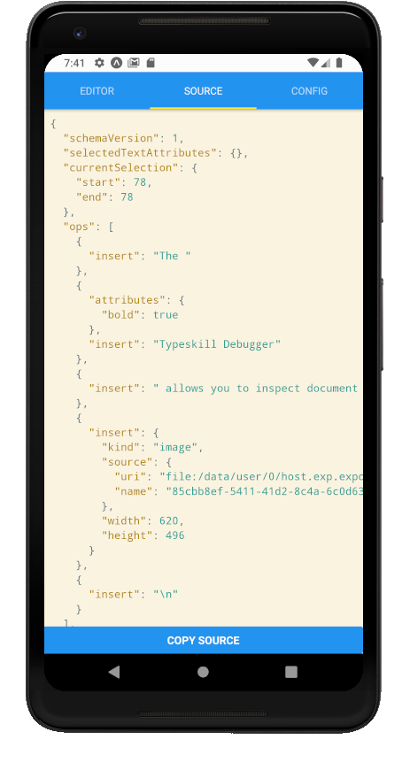
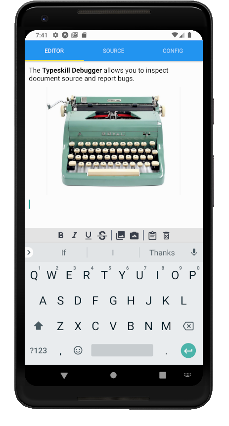

<h1 align="center">
<code>
    @typeskill/debugger
</code>
</h1>
<p align="center">
  <em>
    A utility to inspect, reproduce and report bugs from <code>@typeskill/typer</code>.
  </em>
</p>
<p align="center">
    <a href="https://www.npmjs.com/package/@typeskill/debugger" alt="Npm Version">
        </a>
    
</p>
<p align="center">
  
  
</p>

## Setup

> You must install the typeskill version you wish to test.

## Example (typescript)

**Remark**: You must import and use `COPY_DOCUMENT_SOURCE_ACTION` constant when building the `Toolbar` layout to have access to "copy document source to clipboard" action.

```tsx
// App.tsx
import React, { PureComponent } from 'react'
import { PermissionsAndroid } from 'react-native'
import { DocumentControlAction, Toolbar, Images, GenericControlAction, buildVectorIconControlSpec } from '@typeskill/typer'
import { Debugger, COPY_DOCUMENT_SOURCE_ACTION } from '@typeskill/debugger'
import MaterialCommunityIcons from 'react-native-vector-icons/MaterialCommunityIcons'
import ImagePicker from 'react-native-image-picker'

function buildMaterialControlSpec(actionType: GenericControlAction, name: string) {
  return buildVectorIconControlSpec(MaterialCommunityIcons, actionType, name)
}

const toolbarLayout: Toolbar.Layout = [
  buildMaterialControlSpec(DocumentControlAction.SELECT_TEXT_BOLD, 'format-bold'),
  buildMaterialControlSpec(DocumentControlAction.SELECT_TEXT_ITALIC, 'format-italic'),
  buildMaterialControlSpec(DocumentControlAction.SELECT_TEXT_UNDERLINE, 'format-underline'),
  buildMaterialControlSpec(DocumentControlAction.SELECT_TEXT_STRIKETHROUGH, 'format-strikethrough-variant'),
  buildMaterialControlSpec(DocumentControlAction.INSERT_IMAGE_AT_SELECTION, 'file-image'),
  buildMaterialControlSpec(COPY_DOCUMENT_SOURCE_ACTION, 'clipboard-text-outline')
]

interface ImageSource {
  uri: string
  name: string
}

export default class App extends PureComponent {

  private pickOneImage = async () => {
    await PermissionsAndroid.request('android.permission.CAMERA')
    return new Promise<Images.Description<ImageSource>>((res, rej) => {
      ImagePicker.showImagePicker({}, (response) => {
        if (response.didCancel) {
          rej(new Error('User cancelled.'))
        }
        if (response.error) {
          rej(new Error(response.error))
        }
        res({
          source: {
            uri: response.uri,
            name: response.fileName,
          },
          width: response.width,
          height: response.height
        } as Images.Description<ImageSource>)
      })
    })
  }

  render() {
    return (
      <Debugger pickOneImage={this.pickOneImage} toolbarLayout={toolbarLayout} />
    )
  }
}
```
